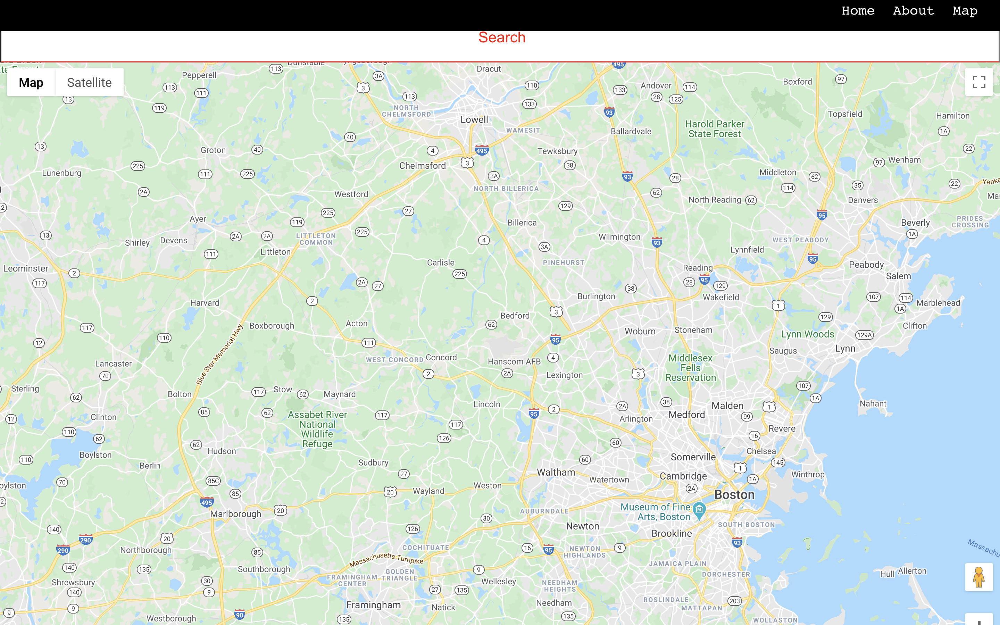

# 🚀 Welcome to SNAP App Locator API !

SNAP stands for the Supplemental Nutrition Assistance Program mandated by the Federal Government and supervised by states to help millions of individuals and families who need financial assistance to buy food. Formerly known as the Food Stamp Program, SNAP provides an economic benefit as well as serving to eliminate hunger. 

SNAP Store locator is an application that helps users find access to SNAP retailers and grocers.
Communities suffer disproportionately from illness related to lack of access to fresh and healthy foods.

SNAP Store Locator will allow the user to search for retailers and grocers nearby that accept SNAP benefits and also provide a list of food items that are sold.

Client: snap-client: https://github.com/alyrlee/snap-client

## Open Endpoints

Open endpoints require no Authentication.

* [Find](find.md) : `POST /api/find`
* [Stores](stores.md) : `POST /api/stores`

API: snap_locator_api: https://github.com/alyrlee/snap_locator_api

How to get started?

You can start by clicking on the "Get Started" button and you will be taken to the map.

<hr>





## Technologies used:

```
Client:
```
<br>

Javascript: https://www.javascript.com/

CSS: https://developer.mozilla.org/en-US/docs/Web/CSS

React.js: https://reactjs.org/

React-Router-Dom: https://reactrouter.com/web/guides/quick-start

History: https://reactrouter.com/web/api/Hooks/usehistory

```
Server:
```
<br> 

Node.js: https://nodejs.org/en/

Express.js: https://expressjs.com/

Morgan: https://github.com/expressjs/morgan#readme

Cors: https://developer.mozilla.org/en-US/docs/Web/HTTP/CORS

Helmet: https://helmetjs.github.io/

XSS: https://jsxss.com/en/index.html

Nodemon: https://nodemon.io/

Knex: https://knexjs.org/#Installation-client

Dotenv: https://github.com/motdotla/dotenv#readme

postgreSql: https://www.postgresql.org/

```
Testing with:
```
<br>

Chai: https://www.chaijs.com/plugins/chai-react-element/

Mocha: https://mochajs.org/

Supertest: https://github.com/visionmedia/supertest#readme

```
APIs: 
```
<br>

google-maps-react: https://github.com/fullstackreact/google-maps-react#readme

react-google-autocomplete: https://github.com/ErrorPro/react-google-autocomplete#readme

react-geocode: https://github.com/shukerullah/react-geocode#readme

<br>

## Considerataions for app development:

Future implementation of registered user savedLocations route to render dashboard in the user profile that displays store information and user saved information in regard to snap retailer locations.

See below for instructions on how to run and modify this application locally after cloning the repository.


## Scripts

Start the application `npm start`

Start nodemon for the application `npm run dev`

Run the tests in watch mode `npm test`

## Deploying

When your new project is ready for deployment, add a new heroku application with `heroku create`. This will make a new git remote called "heroku" and you can then `npm run deploy` which will push to this remote's master branch.
